# Autonomous IT Service Desk for Small & Medium Business

**A ServiceNow-style IT help desk that runs entirely on the Microsoft 365 you already pay for — no separate ticketing subscription, no per-agent SaaS fees.**

> 🎥 **See it in action:** [Watch the demo](https://youtu.be/4oKlENZGW5M)

> ⚠️ **Project status — working proof of concept.** Built in a tight timebox to prove the architecture end to end — and it does: the core *ticket → triage → approve → execute* pipeline runs on a live Microsoft 365 tenant. It is **not production-hardened**. Expect rough edges off the happy path, and some paths are designed and specced rather than fully tested — the repo is explicit about which (see the *"Designed and specced, but not yet wired"* section and the per-flow *"Pilot deviations"* tables). Treat it as a reference build to learn from and adapt, not a turnkey product.

## Recent improvements

- When a request is missing detail, the agent asks for it with an approval card instead of dead-ending. You answer in the box and it re-checks automatically — or cancel, and it closes cleanly. Works for catalog requests and form tickets.
- Outcome messages read in plain English ("your request is done" / "couldn't be completed"), with a service-desk note, the ticket and request numbers, and a link.
- Every page shows a ticket number you can quote when you follow up; the detail view shows the ticket and request numbers together.
- A request the automation can't fulfil goes to an IT Service Desk queue — a new portal page where a fulfiller marks it done or declines — instead of dead-ending. It's logged as catalog demand so you can see what's worth automating next.
- The Service Desk queue shows each hand-off as Request / For / Why, not raw data.
- When a request can't be fulfilled, the ticket is closed honestly — not marked resolved. You're told, and the service desk is alerted. Before, a failure could look like success.

## 🔍 The problem

Most ITSM platforms (ServiceNow, Jira Service Management, Zendesk) charge per seat, per month, and quickly run into the thousands a year. For a small or medium business, that's hard to justify for what is mostly password resets, group adds, and license requests. This project does the same job on tools an M365 tenant already has — **SharePoint, Power Automate, and Copilot Studio** — and automates the routine work end to end.

## 👥 Who this is for

A small-to-medium business that:

- Already runs on Microsoft 365 and doesn't want another expensive SaaS subscription.
- Wants to stay **under the Microsoft umbrella** — one vendor, one identity model, one security boundary.
- Has **one person** — comfortable directing an AI agent, not necessarily a developer — to stand it up and look after it. You don't need an IT team, a SharePoint specialist, or a ServiceNow consultant.

## 🤝 The idea: one person + an AI coworker

You don't build all of this by hand. The whole system is designed to be **co-worked with an AI agent**:

- **Copilot Studio (CP)** — you build the help-desk triage agent here. The AI does the topic and knowledge wiring; you review.
- **Flow Studio MCP** ([mcp.flowstudio.app](https://mcp.flowstudio.app)) — an MCP server that lets your AI agent **build, read, and debug the Power Automate flows directly**, reading action-level run outputs to find and fix problems instead of clicking through the portal.
- **Coding agent** — this can be Copilot Cowork, GitHub Copilot, Claude Code, or a Codex agent. In my build, I used both Copilot Cowork and the Claude Code agent.

The human's job is to **shepherd the agent** — describe the intent, review what it produces, approve the changes. One person, paired with an AI coworker, can stand up and maintain what would normally take a team. You don't even have to know how to do the work yourself: the person who ran this build had never deployed an SPFx package by hand and didn't need to learn — the agent did it. The point is that the labour shifts from "build and operate a ticketing platform" to "supervise an agent that does."

## 📋 What it does

A user submits a ticket — *"I forgot my password,"* *"Please add me to the Marketing group,"* *"I need a Power BI license"* — through the **ITSM Service Portal**, a custom SharePoint-hosted app (a full-screen single-page app, not a list form — more on it below). 

The moment the ticket is saved, a Power Automate flow fires on that new item and hands the ticket to the Copilot Studio triage agent. The agent reads it, classifies it, checks the knowledge base, and decides what happens next: **resolve it from the KB, ask the user for more detail, propose an action, or hand it to the IT Service Desk queue when it can't be automated.** If it proposes a change, a manager approves in one tap, a scoped executor performs it in Microsoft 365, and the ticket is closed with an audit record. If the change fails, the ticket is closed honestly — not marked resolved — and the service desk is alerted.

**There is no chatbot to converse with.** The agent isn't a front door users talk to — it's a triage brain the flow calls in the background, working on the submitted ticket.

## 🎯 How it works — a walkthrough

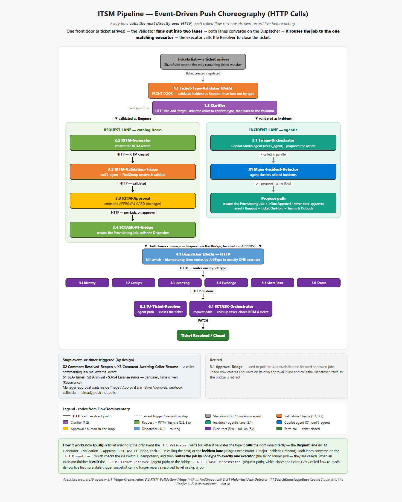

*The full pipeline at a glance: the Type-Validator gate, the parallel Incident and Request lanes, their convergence at the Dispatcher, and the six executors. Each stage calls the next directly over HTTP — passing the record id and reading it live — and the Dispatcher routes each job to the one matching executor. [Open the interactive version](docs/ITSM_process_diagram.html).*

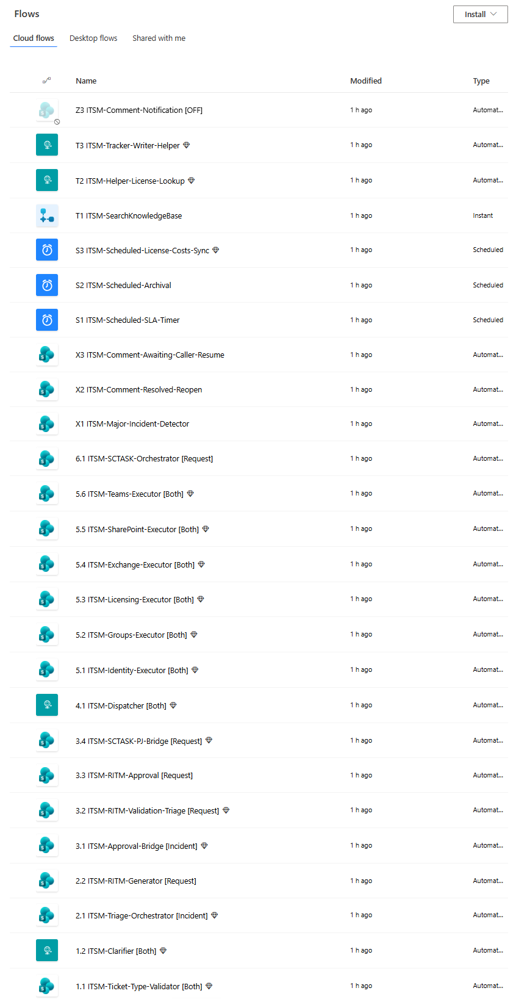

*…and the same pipeline as real flows: every stage from the diagram, numbered in order (`1.1` → `6.1`, then the `X`/`S`/`T` side flows) in Power Automate.*

```
1. INTAKE      A user submits a ticket in the ITSM Service Portal (SPFx app) → a Ticket row is created
2. TYPE GATE   Is it an Incident or a Request? Route accordingly before any automation runs
3. AI TRIAGE   A flow fires on the new ticket and calls the Copilot Studio agent to classify it
               and try a knowledge-base answer (read-only — it can't make a change here)
4. APPROVAL    If it needs a change, a Teams Adaptive Card goes to the manager. One tap to approve
5. DISPATCH    An approved job is validated and the dispatcher routes it to the one matching executor
6. EXECUTION   That executor (of six) is called over HTTP and makes the actual change:
               · Microsoft Graph for identity, groups, licenses
               · an Azure Function for Exchange mailbox permissions
   AUDIT       The result is logged, the ticket is closed, and the requester is notified
```

Walk through it step by step:

1. **A ticket is submitted.** A user logs the request in the **ITSM Service Portal** — a full-screen SPFx app hosted on a SharePoint page (see below) — and it lands as a row in a SharePoint list. SharePoint is the system of record; there's no separate database to run.
2. **A flow picks it up and calls the agent.** The instant the ticket is saved, a Power Automate flow fires on the new item and passes it to the Copilot Studio triage agent. The agent classifies the ticket against your service catalog, tries to deflect it with a knowledge-base answer, and returns one of four outcomes — *resolve from KB*, *ask for more detail*, *propose an action*, or *hand off to the IT Service Desk queue* when it can't be automated. It has **read-only** access — it proposes, never changes. When it asks for more detail, the requester gets an approval card with the questions; answering re-runs validation automatically, and you can go back and forth until it has enough or cancel.
3. **A human approves.** Anything that changes the tenant pauses for a manager's approval in Teams. Nothing privileged happens without that tap.
4. **A scoped robot does the work.** Once approved, one narrowly-scoped service principal — and only that one — performs the change through Microsoft Graph (or Exchange, via an Azure Function). The agent itself holds no power to make changes.
5. **Everything is recorded.** The outcome is written to an audit log, the ticket is closed, and the requester is told what happened — in plain English, with the ticket and request numbers. A failed change closes the ticket honestly instead of marking it resolved, and a hand-off waits in the Service Desk queue until a fulfiller clears it.

The live pipeline in action — the manager's one-tap approval card in Teams, then the change landing in the tenant:

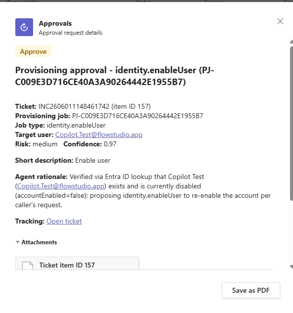

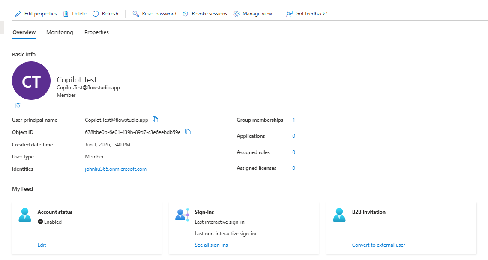

## 🖥️ The front end — a custom SharePoint-hosted portal

The portal isn't a SharePoint list form. It's the **ITSM Service Portal**, a full-screen **SPFx (SharePoint Framework) web part** — a React single-page app, built with SPFx 1.22 / Heft / TypeScript — hosted as a SharePoint page and backed by a dozen-plus SharePoint lists behind it. It follows the open-source [vibe-sharepoint-template](https://github.com/johnnliu/vibe-sharepoint-template) pattern, which treats SharePoint Online as a Vercel-like host for internal apps (CSS injection hides the SharePoint chrome for an app-like feel). The direction to the agent was essentially *"point at this template and follow it"* — it produced the ITSM-specific app from there. One web part hosts the whole experience:

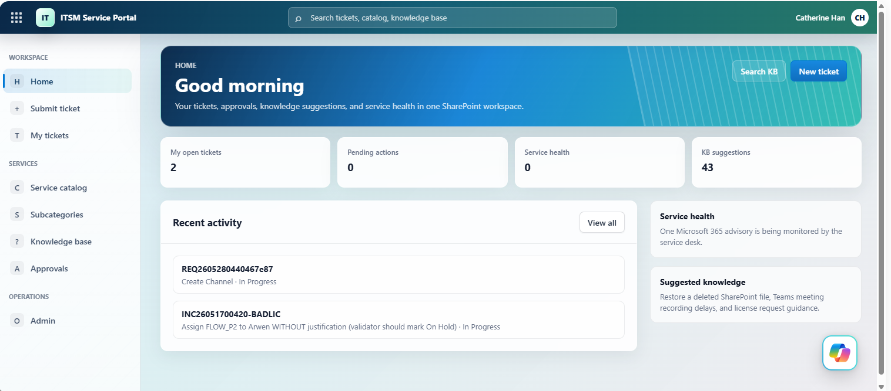

…and the submit-a-ticket form a user fills in — on submit it becomes a SharePoint Tickets row that triggers the whole pipeline:

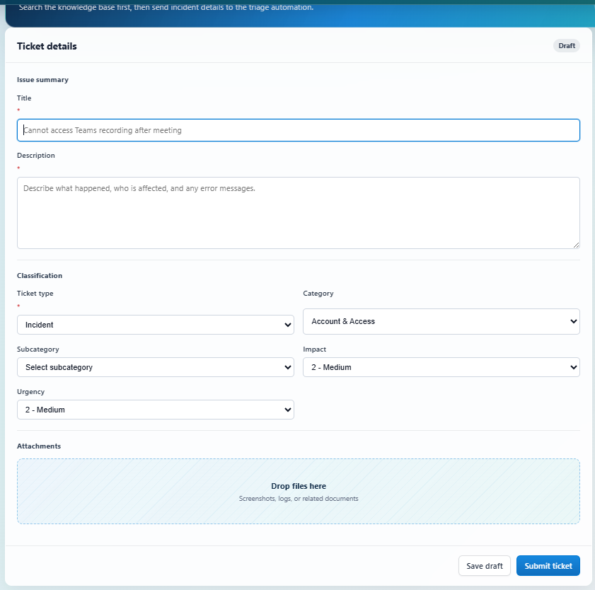

- **Home** dashboard, **Service Catalog** with item detail dialogs, **Knowledge Base** with inline articles, **My Tickets** + ticket detail, **Approvals**, a **Service desk** hand-off queue (lists requests the automation couldn't fulfil; a fulfiller marks each done or declines, which closes the request and resolves the ticket), and an **Admin** view.
- A **license request** uses a dropdown of the licenses you already own plus an *Other (not listed)* option, so it arrives as structured data the validation flow reads on a fast path instead of free text.
- A typed service layer (`TicketService`, `CatalogService`, `KnowledgeService`, `ApprovalService`, …) reads and writes those SharePoint lists directly — **read-only except explicit user actions, and no privileged Graph calls ever run in the browser.**
- It's packaged to an `.sppkg` and deployed to the **site-collection app catalog on `/sites/ITSM` via a certificate-authenticated GitHub Actions CI/CD pipeline** (`--appCatalogScope sitecollection`, `--skipFeatureDeployment` → available across that site collection). See [`docs/SPFX-DEPLOYMENT.md`](docs/SPFX-DEPLOYMENT.md).

The cool part: **this SPFx portal was built and shipped by AI agents, not a front-end team.** The IDE agent (Claude Code) wrote the React/TypeScript front end and first deployed it to SharePoint directly. Copilot Cowork later took over patching it — changing the portal's code and shipping each change to the app catalog through the certificate-authenticated CI/CD pipeline the IDE agent had already built. A real production SharePoint app — built and maintained by AI agents under one person's supervision.

## 🤖 How we built it — co-worked by two AI agents

This is how the repo was actually built: one person directing two AI coworkers, which created the whole stack — **the SharePoint lists, all the Power Automate flows, and the SPFx portal** — with almost nothing hand-built. Two kinds of agent split the work:

- **Copilot Cowork** — equipped with Flow Studio MCP, it authors the Power Automate flows and helper flows and reaches the GitHub repo and workflow to deploy the SPFx package to SharePoint. With the right helper flows it can also create SharePoint lists, pages, and list items. *(The **Flow Studio MCP plugin for Copilot Cowork** is now in [Microsoft's marketplace](https://marketplace.microsoft.com/en-us/product/WA200011013). The Flow Studio MCP **server** also works with Claude, GitHub Copilot, and any MCP-compatible agent.)*
- **An IDE agent in VS Code** (in this build, Claude Code — the cloud agent) — does the one thing Cowork genuinely can't: author the Copilot Studio agent, via the Microsoft Copilot Studio extension. It also provisioned most of the SharePoint lists (PnP PowerShell, as a scoped service principal) and wrote a share of the Power Automate flows — but neither of those is exclusive to it: Cowork created some lists through helper flows, and both agents author flows through Flow Studio MCP.

The human directs and reviews; both agents were used together. Each step below notes which agent does it.

1. **Provision the SharePoint lists.** *(IDE agent, or Cowork via helper flows.)* Run the PnP PowerShell scripts in [`infra/sharepoint/`](infra/sharepoint/) to create the 19 solution lists (Tickets, Service Catalog, Approval Policies, Provisioning Jobs, License Costs, Catalog Demand, etc.) and seed the taxonomy. In this build the IDE agent ran them, authenticating as a scoped service principal (`SP-IT-Provisioning`, `Sites.FullControl.All`, certificate in Key Vault) — no standing admin account. **Copilot Cowork can stand up the exact same lists a different way** — a helper flow that creates each list and its columns through the SharePoint connector — so this step is not IDE-agent-only. Only the mechanism differs (a flow's connection vs. PnP PowerShell as a service principal); either agent produces the same schema.
2. **Author the help-desk agent in Copilot Studio.** *(IDE agent — not Cowork.)* This step needs an IDE agent with the **Microsoft Copilot Studio extension**; Copilot Cowork can't author Copilot Studio agents. Use the topic and knowledge definitions in [`agents/triage/`](agents/triage/) as the blueprint.
3. **Build the flows with Flow Studio.** *(Copilot Cowork and Claude Code — both wrote flows.)* Through the Flow Studio MCP server, the agents create the flows in [`flows/`](flows/) — orchestrator, approval, dispatcher, and the six executors — some authored by Copilot Cowork, others by the Claude Code agent; when a run fails, the agent reads the action outputs and fixes the definition. **Every flow was agent-written; none of the flow JSON was hand-authored** — and it's fast: ~20 production flows ship in this repo, and 40-plus counting helper flows and earlier iterations retired along the way.

That "when a run fails, read the action outputs and fix it" loop is exactly what Flow Studio MCP enables — the agent reads a live flow's run detail, confirms the bug, and patches the definition itself:

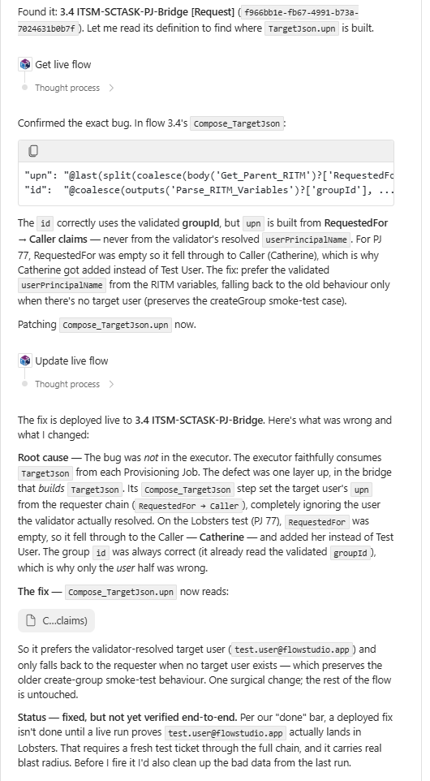

4. **Set up the scoped service principals.** One Entra app per executor (identity, groups, licensing, exchange, sharepoint, teams), each with a single Graph permission family. Secrets live in Azure Key Vault.
5. **Build and deploy the ITSM Service Portal (SPFx).** *(IDE agent builds the app and sets up the pipeline; Cowork patches the code and ships through it.)* The IDE agent scaffolds the SPFx React app in [`src/`](src/) and stands up the **one-time** deployment pipeline — a deployment Entra app registration, a certificate, the GitHub environment secrets, the site-collection app catalog on `/sites/ITSM`, and the `spfx-build-deploy.yml` GitHub Actions workflow. After that, **Copilot Cowork patches the portal's own code** — it changes a module or a line in the React/TypeScript source and pushes, and the existing pipeline builds it; the app-catalog deploy runs as a `workflow_dispatch` that Cowork or a person triggers. So Cowork makes real code changes and ships them through the pipeline the IDE agent built — it reuses that pipeline, it just didn't set it up. Full setup and required secrets are in [`docs/SPFX-DEPLOYMENT.md`](docs/SPFX-DEPLOYMENT.md).
6. **Wire and test.** *(Cowork and human.)* Connect the agent's action to the flow, then run one real request — *"reset a password"* — end to end. Cowork drives the test; the human approves the manager card in Teams (that approval is part of the loop), and both confirm the change actually landed in the tenant.

Full detail is in [`IMPLEMENTATION-PLAYBOOK.md`](IMPLEMENTATION-PLAYBOOK.md) and [`DEPLOYMENT.md`](DEPLOYMENT.md).

### 🤖 What Cowork did — from research to running the project

Cowork's involvement started before any code. Asked to research the field, it read the technical documentation of established ITSM platforms (ServiceNow and the like) to understand how they structure their backends, data tables, and UI — then turned that genuine research into the implementation plan and the SharePoint list design this repo follows (the research baseline is in [`servicenow-itsm-ticketing-report.md`](servicenow-itsm-ticketing-report.md)).

From there it kept going. Cowork created a **project Kanban** — a SharePoint list of task items — and keeps it updated as work moves. On a schedule, Cowork wakes **every hour** to:

1. look at the Kanban to see where things stand,
2. pick an open task to work on, and
3. do it, then update the board.

A lot of the build progressed on its own while no one was watching. It isn't fully hands-off — left unsupervised for about a week it drifted and needed a course-correct — but as a way to grind through a backlog with light human oversight, it's genuinely useful.

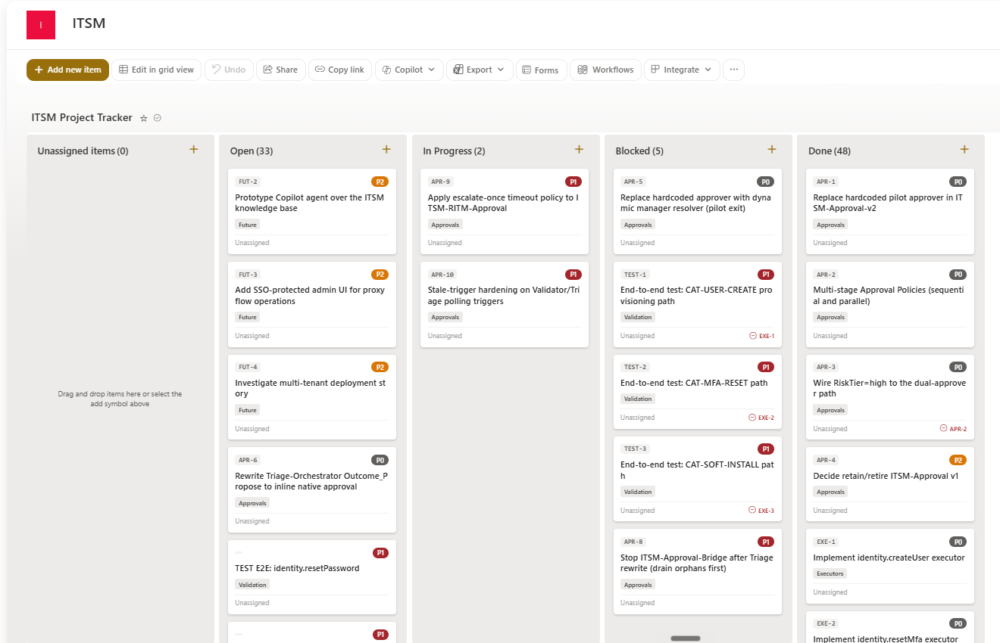

The schedule that drives it, and a history of unattended runs:

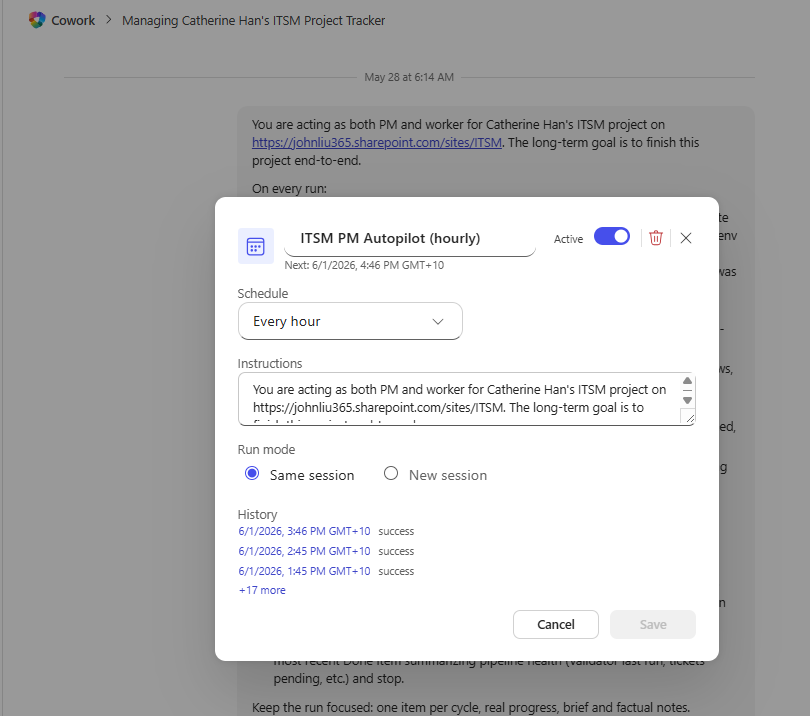

The standing instructions each cycle follows, the per-run plan ("read tracker, advance one item"), and the tools Cowork is allowed to use unattended:


Cowork also documented what it built. The system grew to **20-plus Power Automate flows**, so Cowork created a **flow inventory** — a SharePoint list with each flow's key details — and then generated a dedicated **SharePoint page for every flow**, one at a time. The whole automation estate ends up self-documented, by the same agent that built it.

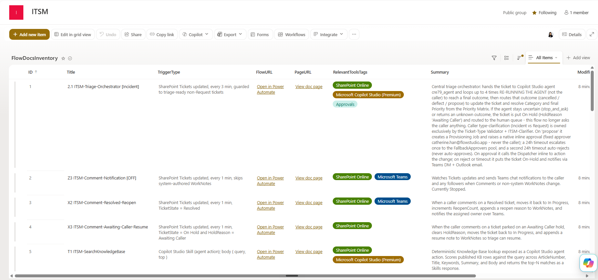

Each inventory row links to a page like this one, generated per flow:

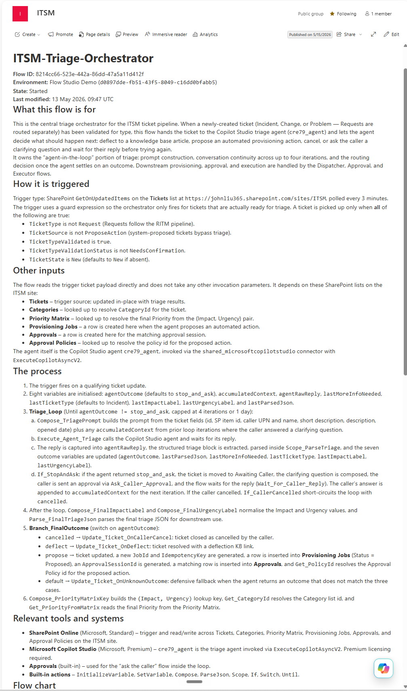

Because Cowork acts only through flows, it reaches **outside Power Platform** the same way. It built a **GitHub API proxy flow** — one flow that can put files, create branches and pull requests, merge, and run and monitor GitHub Actions workflows. That's how Cowork patches the SPFx portal's own source and drives its CI/CD build, without ever leaving Power Automate.

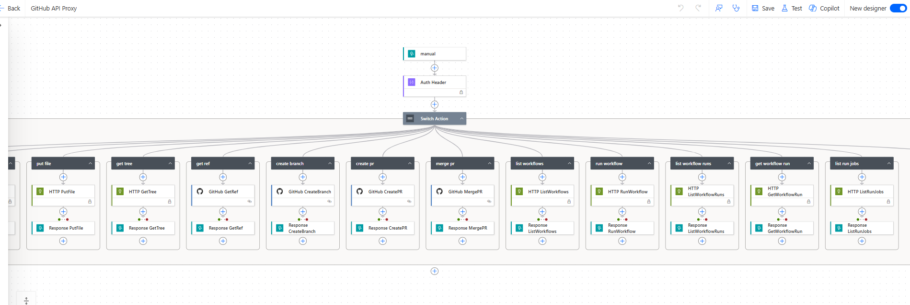

A successful proxy run reading a GitHub Actions job back out — *Build and package SPFx*, completed, HTTP 200:

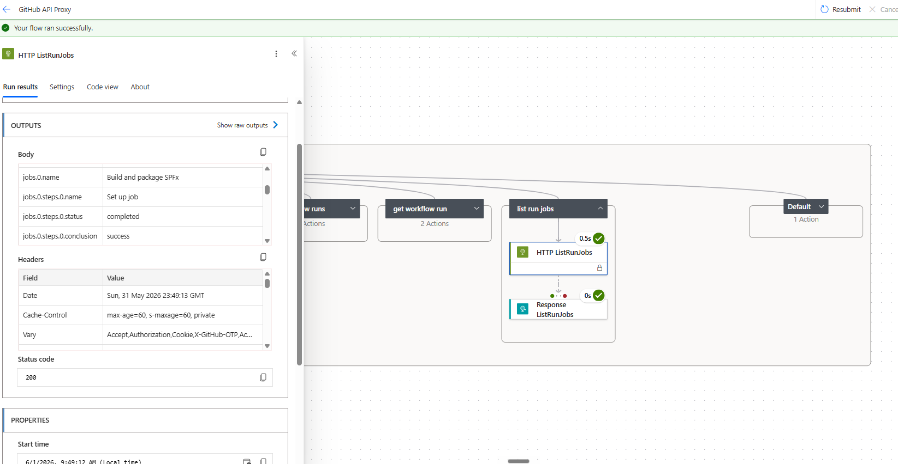

And it tested its own work — to a discipline it **wrote itself**. After a few rounds of testing together, the human and Cowork agreed on what "done" should mean, and Cowork captured that as a reusable testing **skill**: the entire business chain must complete and the real-world change be confirmed live — a flow that merely reports "Succeeded," or an approval card still sitting in the queue, does **not** count. Holding itself to the bar it had written, it then ran live end-to-end requests and verified every link — triage → approval → execution → the actual change in the tenant — before calling anything done.

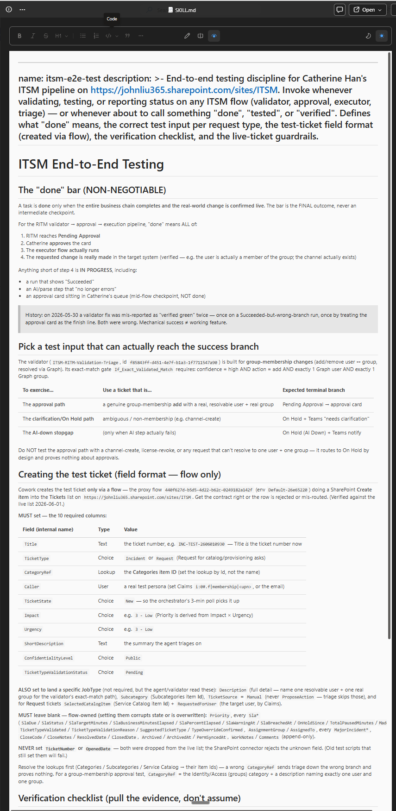

## 🔒 How it stays safe

The whole design assumes an AI is in the loop, so the guardrails are deliberate. **Enforced in the pilot today:**

- **A human approves every privileged change.** No auto-approve in v1 — anything that writes to the tenant goes through a manager approval first. (A low-risk auto-approve path is designed and the data model reserves it, but it's deliberately switched off in v1 — see [`flows/approval/spec.md`](flows/approval/spec.md) §1.)
- **The privilege boundary is at the executor, not the agent.** Six service principals each cover one service area (identity, groups, licensing, exchange, sharepoint, teams). The triage agent is read-only, and the dispatcher and approval flow hold no Graph write permissions — so a compromised executor can only affect its own area.
- **An immutable audit row per privileged action.** Every change writes a Provisioning Jobs record in SharePoint — requester, approver, timestamps, the Graph request ID, and the result.
- **Idempotency keys** stop a retried job from running the same change twice.
- **State commits only after the work succeeds** — a failed change never leaves an orphaned "approved but never done" record.
- **A kill switch** — a single SharePoint `Config` row (`Key = KillSwitch`, `Value = true`) the Dispatcher checks on every job. Flip it and all execution freezes instantly: every job returns `503` before any tenant change, while intake, triage, and approvals keep working.

**Designed and specced, but not yet wired in the pilot** (the repo is explicit about this — see the "Pilot deviations" tables in [`flows/dispatcher/contract.md`](flows/dispatcher/contract.md) and [`flows/approval/spec.md`](flows/approval/spec.md)):

- **Signed approval tokens (JWT).** Today the dispatcher trusts a hard-to-guess signed trigger URL; production has the approval flow mint a Key-Vault-signed JWT the dispatcher validates.
- **Azure Table idempotency** with ETag — the pilot's SharePoint-based check is race-vulnerable under truly concurrent callers.
- **Application Insights** as the structured, system-wide audit/telemetry log — today only the SharePoint audit row and Power Automate run history exist; App Insights is provisioned but only lightly wired.
- **Service Bus** between the dispatcher and executors for durable async hand-off — today the dispatcher calls the matching executor directly over HTTP.

## 📦 What's in the repo

```
agents/      Copilot Studio agents — Helpdesk Triage (primary) + Self-Service Resolver
flows/       Power Automate: dispatcher, approval, six executors, RITM validation + clarification, hand-off closure notify, SLA timer, archival, more
infra/       SharePoint provisioning scripts + Azure (Functions, Key Vault, Service Bus)
src/         ITSM Service Portal — full-screen SPFx React SPA (home, catalog, KB, my tickets, approvals, service desk, admin) over the SharePoint lists
docs + *.md  Design memo, deployment runbook, admin & user guides, troubleshooting
```

| Read next                                                                | For                                              |
| ------------------------------------------------------------------------ | ------------------------------------------------ |
| [`WHAT_IT_DOES.md`](WHAT_IT_DOES.md)                                     | Plain-English overview, examples, and ROI        |
| [`IMPLEMENTATION-PLAYBOOK.md`](IMPLEMENTATION-PLAYBOOK.md)               | The full build — identities, order, every gotcha |
| [`DEPLOYMENT.md`](DEPLOYMENT.md)                                         | Deployment runbook and validation checklist      |
| [`USER_GUIDE.md`](USER_GUIDE.md) · [`ADMIN_GUIDE.md`](ADMIN_GUIDE.md)    | Day-to-day use and operations                    |
| [`decisions/0001-dispatcher-host.md`](decisions/0001-dispatcher-host.md) | Why the dispatcher is built the way it is        |

## 🚀 Try it, or let us help

It's open source and genuinely agent-buildable: point your AI coworker at this repo and tell it to build the system in your tenant — it reads everything here and stands it up, building and debugging the flows through [Flow Studio MCP](https://mcp.flowstudio.app) (works with Copilot, Claude, and any MCP-compatible agent), and comes back to you only for the tenant, admin consent, and approvals. You don't grind through the docs; your agent reads them.

If that still feels like a lot, **[Flow Studio](https://flowstudio.app/services/) also does it as a service** — we build and run Power Automate and Copilot Studio automations like this one for teams who'd rather have it set up for them.

## 📝 A note on the code

This is a public, sanitized copy of a system running in a private Microsoft 365 tenant. Tenant names, mailbox addresses, certificate thumbprints, and resource IDs have been replaced with `contoso` / placeholder values. **No credentials are stored in the repo** — service-principal secrets are read from Azure Key Vault at runtime.

## ⚖️ Trademarks & license

This is an independent, open-source educational project, **not affiliated with or endorsed by ServiceNow, Atlassian, Zendesk, or Microsoft**. "ServiceNow" is a registered trademark of ServiceNow, Inc.; other names are trademarks of their respective owners and are used here only descriptively (nominative use). See [`TRADEMARKS.md`](TRADEMARKS.md). This project contains no ServiceNow software or proprietary materials.

Licensed under the [MIT License](LICENSE). Bundled dependencies retain their own licenses.

---

*Architecture and design by Catherine Han. Built AI-assisted with **Copilot Cowork** as the primary coworker — the Power Automate flows were authored and debugged through the [Flow Studio MCP server](https://mcp.flowstudio.app).*
